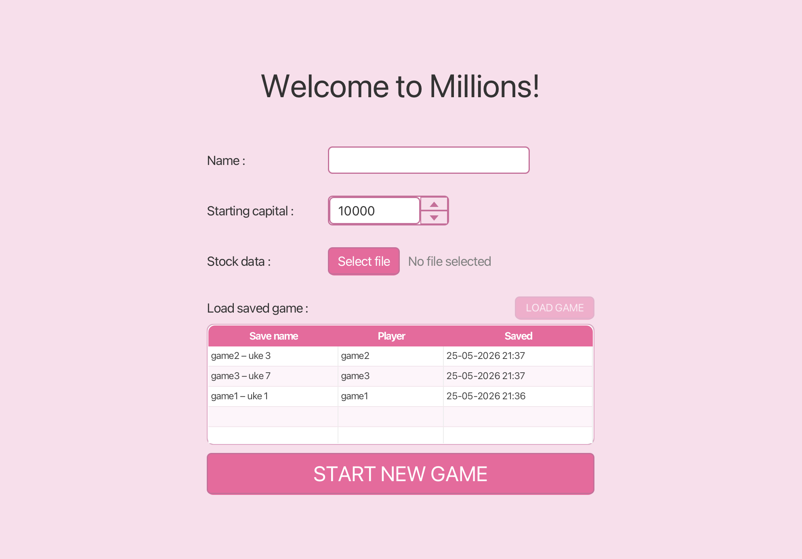
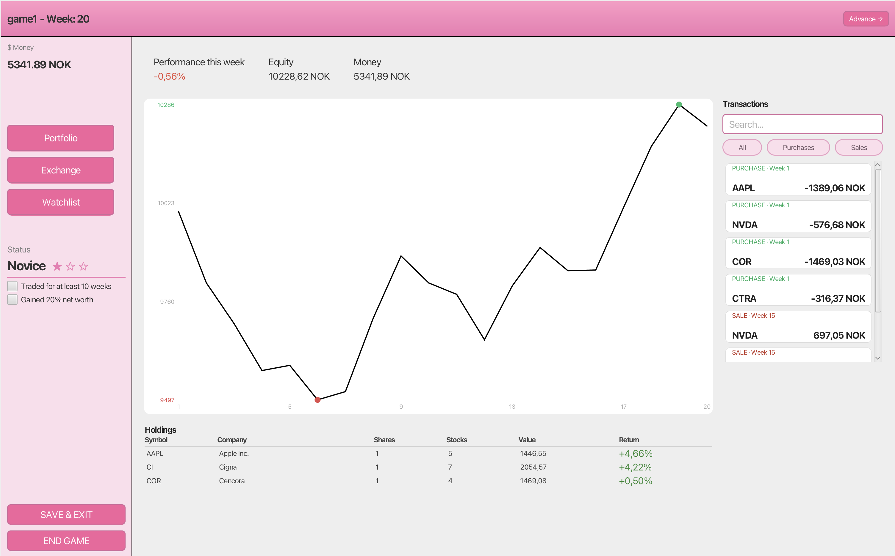
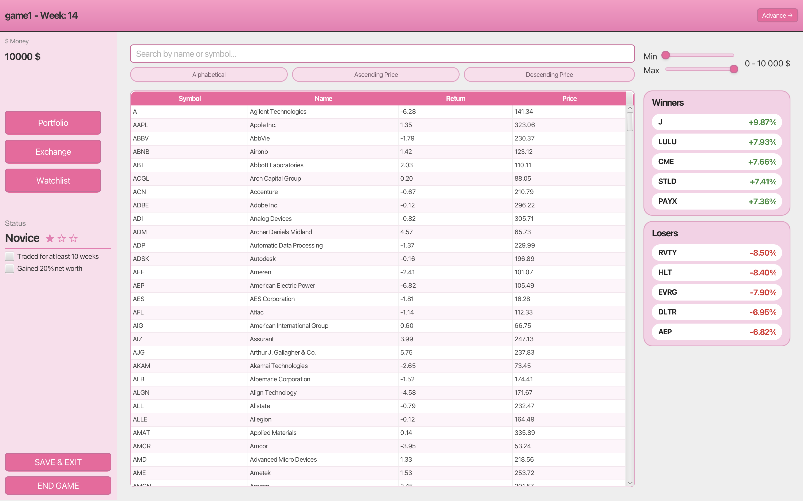
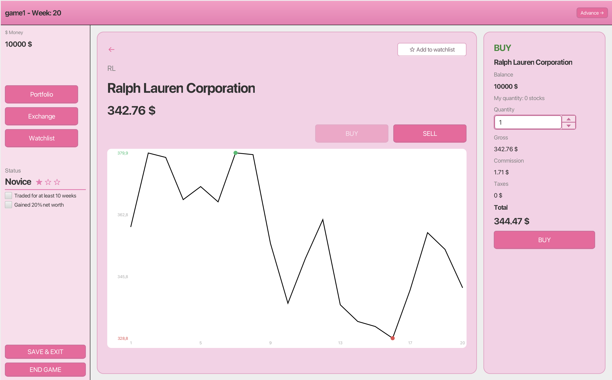
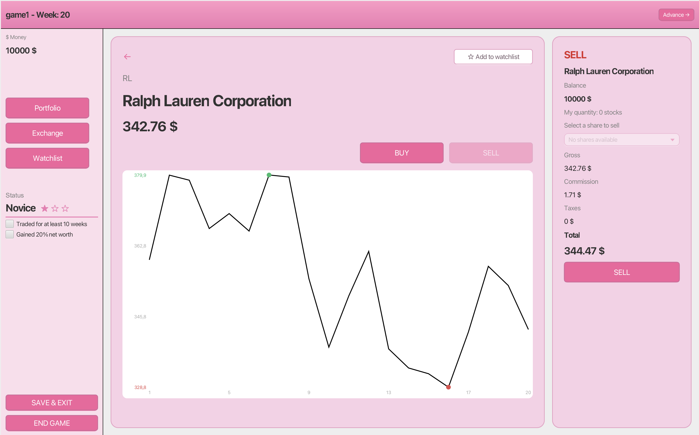
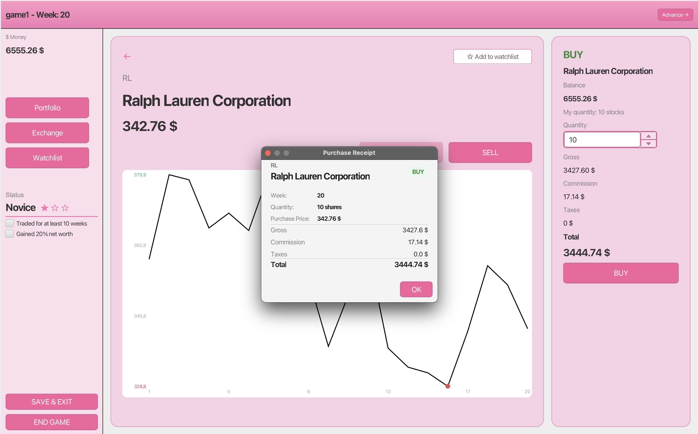
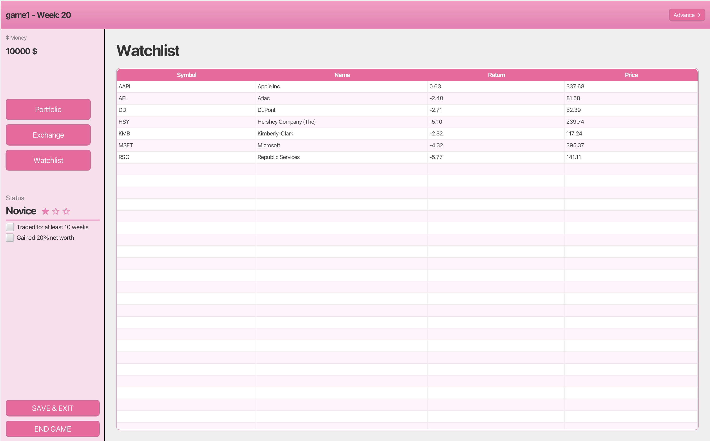
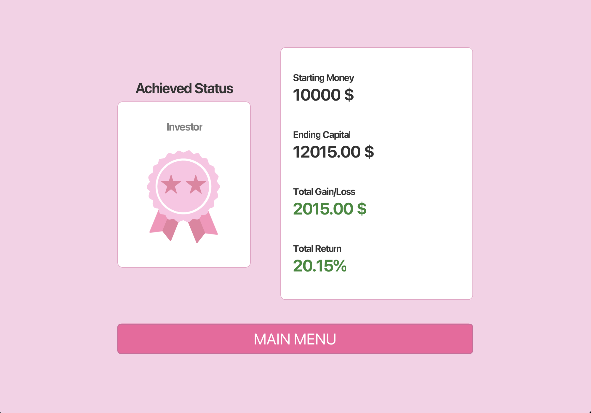

# Millions - Stock Trading Game

Millions is a week-by-week stock trading game where players buy and sell stocks, manage their portfolio, and try to grow their capital to achieve a higher status, all without the risk of real money. Each turn represents one week in the market, and the goal is to maximize your return before the game ends.

---

## Requirements

- Java 25
- Maven 3.x

## How to Run

```bash
mvn javafx:run
```

## Running Tests

```bash
mvn test
```

---

## Gameplay Overview

When you launch the game you are taken to the **Start Screen**, where you either start a new game or load a previously saved one. Once a game is active, the **Main View** stays on screen at all times. The main view contains a sidebar on the left for navigating between views, and a header at the top showing the current week number and game name. From the sidebar you can navigate to your portfolio, the stock exchange, or your watchlist. The **Advance** button in the top-right corner moves the game forward one week.

When you are done playing for the day, **Save & Exit** saves your progress so you can continue later. If you want to end the game permanently, **End Game** sells all your holdings, shows you a summary of your performance, and deletes the save, which cannot be resumed.

Sound effects are included: a click on interactions, a *ka-ching* on trades, and a short melody when the game ends.

---

## Views

### Start View

The first screen you see when launching the game. Enter a name, choose a stock data file, and set a starting capital to begin a new game, or load a previously saved game to pick up where you left off.

<div align="center">
  
</div>

---

### Portfolio View

The default view once a game starts. At the top you find this week's performance in percent, your total portfolio value, and available cash for trading. Below that is a price chart showing how your total wealth has developed over time. Under the chart is your **Holdings** table, which lists every stock you own at least one share of, including symbol, company name, number of shares, total shares, current value, and return. Clicking a row in the holdings table takes you directly to the Trade View for that stock.

On the side you find all your **Transactions**, which can be filtered and searched. Clicking a transaction opens the receipt for that trade.

<div align="center">
  
</div>

---

### Exchange View

Reached via the sidebar. Lists all stocks available on the exchange, with support for sorting, filtering, and searching. On the side you find this week's top winners and losers with their symbol and return. Clicking any row takes you to the Trade View for that stock.

<div align="center">
  
</div>

---

### Trade View

Shows a price history chart for the selected stock, along with the symbol, company name, and current price per share. Use the **Buy** and **Sell** buttons to switch between modes. The active mode's button is disabled to indicate which mode you are in.

- **Buy mode**: Choose how many shares to buy, see the price breakdown and total cost, and confirm the purchase. A receipt is shown to confirm the trade.
- **Sell mode**: If you own shares of this stock, select which shares to sell from the dropdown. If you own no shares, the panel is disabled with a message indicating this. A receipt is shown to confirm the sale.

In the top-right corner of the left panel, an **Add to Watchlist** button lets you save the stock to your watchlist, which changes the prompt text to **In Watchlist** once added.

<div align="center">

| Buy mode | Sell mode | Receipt |
|----------|-----------|---------|
|  |  |  |

</div>

---

### Watchlist View

Reached via the sidebar. Shows all stocks you have added to your watchlist for easy access.

<div align="center">
  
</div>

---

### Game Summary View

Shown after clicking **End Game**. All holdings are automatically sold, and you are presented with your final results: the status and medal you achieved, starting capital, ending capital, total gain or loss in currency, and total return in percent.

<div align="center">
  
</div>
